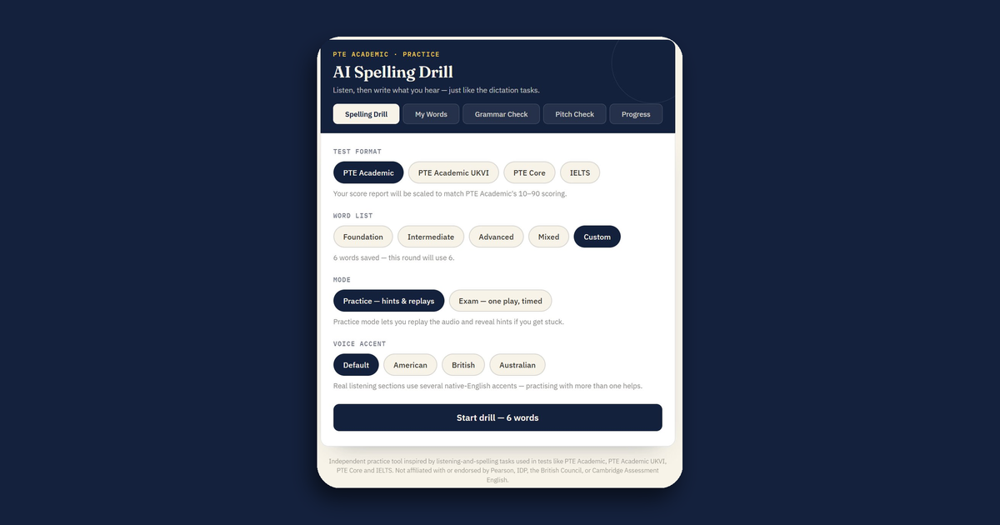

# AI Spelling Drill



**A free, browser-based practice suite for IELTS, PTE Academic, PTE Academic UKVI, and PTE Core — spelling dictation, an AI grammar checker, a voice pitch analyzer, and progress tracking, all in a single static page with no backend required.**

[](https://hasnainmars.github.io/AI-spelling-drill/)  

**[→ Try it live](https://hasnainmars.github.io/AI-spelling-drill/)**

---

## What it does

This started as a simple audio spelling drill and grew into a small test-prep toolkit. There's no server, no database, no build pipeline — it's one HTML file that runs entirely in the visitor's browser, using the browser's own text-to-speech, microphone, and local storage.

### 🔊 Spelling Drill
Hear a word read aloud and type what you heard, the same way "Write from Dictation" works on these tests.
- Four test formats — **PTE Academic**, **PTE Academic UKVI**, **PTE Core**, and **IELTS** — each scored on that test's real scale (10–90 scaled score, or 1–9 IELTS-style bands)
- **Practice mode** (replays + hints) or **Exam mode** (one play, timed, no hints)
- Four built-in word lists (Foundation / Intermediate / Advanced / Mixed), plus your own **Custom** list
- A voice accent picker (Default / American / British / Australian), since real listening sections use multiple native-English accents
- Letter-by-letter diff feedback showing exactly where a misspelling went wrong
- A "Sharpen your spelling" section with tips tailored to the actual mistakes made that round
- Share your score via the native share sheet or clipboard

### ✏️ My Words
Build a personal word list — add words one at a time or paste a whole batch at once — and drill yourself on just those words by selecting "Custom" as the word list.

### ✅ Grammar Check
Paste a sentence or short paragraph and get a corrected version back as a tracked-change-style diff, with short notes on what was fixed. This is the one feature that calls out to Claude to do the actual language reasoning — see [Architecture](#architecture--limitations) below.

### 🎙️ Pitch Analyzer
Record a short speech sample (up to 20 seconds) and see a pitch contour graph of your intonation over time, plus your average pitch, pitch variation, and how much of the recording was actual speech versus pauses — with written remarks and tips aimed at the kind of intonation/fluency assessment used in Speaking tasks. Audio is analyzed locally via the Web Audio API and is never uploaded anywhere.

### 📈 Progress
Every round you complete is saved automatically: total sessions, best accuracy, a day streak, an accuracy chart over your recent sessions, and a session-by-session history.

---

## Architecture & limitations

This is intentionally a zero-backend app, with one exception:

- **Storage** (custom words, progress history) uses the browser's own `localStorage`, so your data lives on whichever device/browser you're using — it isn't synced across devices or visible to other visitors.
- **Grammar Check** calls the Anthropic API directly from the browser. This works out of the box when the app runs inside Claude.ai's own environment, where that call is authenticated automatically. If you self-host this file (e.g. on GitHub Pages, as the live demo is), that call has no credentials and will fail gracefully with a "not available right now" message — an API key should never be placed in client-side code, so making this feature work on a self-hosted copy requires routing it through your own backend (a small serverless function holding a private key is the usual approach). Every other feature works fully standalone.
- **Pitch detection** uses a normalized autocorrelation algorithm tuned for the human voice range (70–500Hz). It's a genuinely working pitch tracker, not a placeholder, but treat its output as a directional practice signal rather than a clinical-grade measurement.

## Tech stack

Plain HTML, CSS, and JavaScript — no frameworks, no package manager, no build tools. Uses native browser APIs throughout: `SpeechSynthesis` (audio dictation), `Web Audio API` (pitch analysis), `localStorage` (persistence), and the `Web Share API` / clipboard (sharing results).

## Running it yourself

Since it's a single static file, hosting takes one step:

1. Download `index.html` (plus `favicon.svg`, `robots.txt`, `sitemap.xml`, and `og-image.png` if you want the full setup).
2. Upload it to any static host — GitHub Pages, Netlify, Vercel, and Cloudflare Pages all have free tiers that work well for this.
3. No build step, no environment variables, no server required.

## Project structure

```
.
├── index.html       # the entire application
├── favicon.svg       # browser tab icon
├── og-image.png       # social-share preview image
├── robots.txt       # crawler access + sitemap pointer
├── sitemap.xml       # single-page sitemap for search engines
└── README.md       # this file
```

## Privacy

No analytics, no tracking, no third-party scripts beyond Google Fonts (for typography) and, only when you use Grammar check, a direct call to Anthropic's API with the text you submit. Recorded audio for the Pitch Analyzer never leaves your device — it's processed in memory and discarded.

## Disclaimer

This is an independent practice tool inspired by the listening, spelling, and speaking-style tasks used in these exams. It is **not affiliated with or endorsed by** Pearson, IDP, the British Council, or Cambridge Assessment English.

## License

No license has been set yet — add one (e.g. MIT) if you want to make clear how others can use or modify this code.
